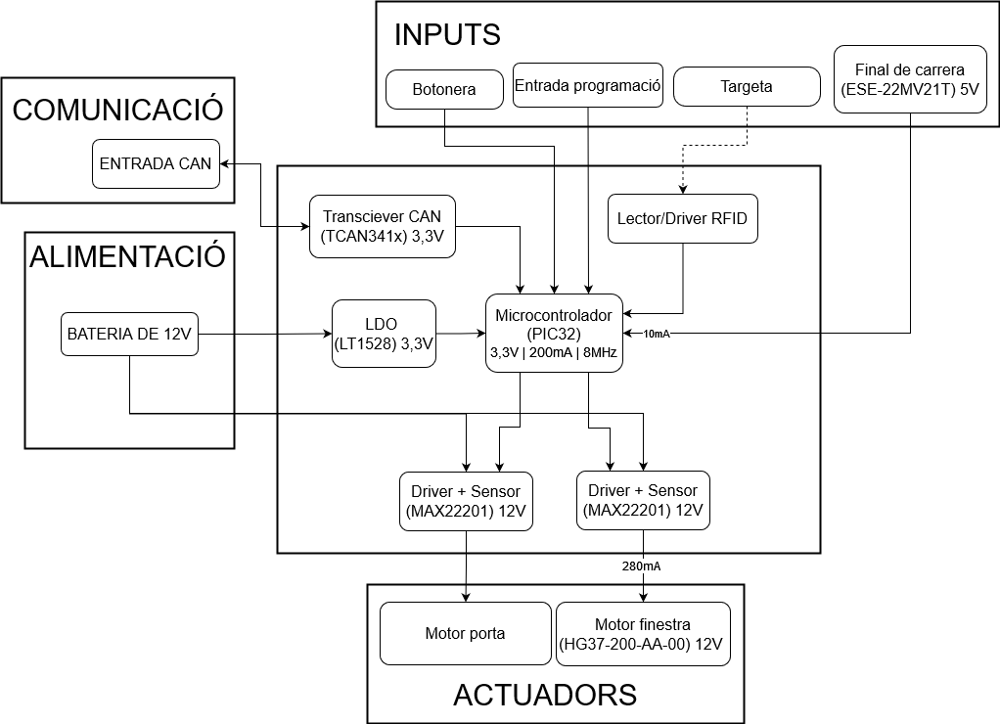

View this project on [CADLAB.io](https://cadlab.io/project/27987). 

# Projecte Eines de Disseny - PORTES
### Adrià Brú, Miquel Limón, Lluís Pujadas

## Especificacions/Components

| Type                     | Name                  | Datasheet                                                                                                                                                                                                                                                                                                                                                                                                                                          | Link                                                                                                                                                     | Price      |
| ------------------------ | --------------------- | -------------------------------------------------------------------------------------------------------------------------------------------------------------------------------------------------------------------------------------------------------------------------------------------------------------------------------------------------------------------------------------------------------------------------------------------------- | -------------------------------------------------------------------------------------------------------------------------------------------------------- | ---------- |
| uC                       | PIC32MK0256MCJ048     | [uC](https://ww1.microchip.com/downloads/aemDocuments/documents/MCU32/ProductDocuments/DataSheets/PIC32MK-General-Purpose-and-Motor-Control-With-CAN-FD-Family-DataSheet-DS60001570D.pdf)                                                                                                                                                                                                                                                          | [Mouser](https://www.mouser.es/ProductDetail/Microchip-Technology/PIC32MK0256MCJ048-E-Y8X?qs=vmHwEFxEFR%2FV8wN%2Fdp0noA%3D%3D)                           | 7,37 €     |
| LDO 3.3V (3A)            | LT1528CT#PBF          | [LDO](https://rocelec.widen.net/view/pdf/nbjrjihvdn/LITCS09222-1.pdf?t.download=true&u=5oefqw)                                                                                                                                                                                                                                                                                                                                                     | [Digikey](https://www.digikey.es/en/products/detail/rochester-electronics-llc/LT1528CT-PBF/13481919)                                                     | 5,75 €     |
| Motor (588Nm, 280mA)     | HG37-200-AA-00        | [motor](https://www.mouser.es/datasheet/2/972/hg37-2525173.pdf)                                                                                                                                                                                                                                                                                                                                                                                    | [Mouser](https://www.mouser.es/ProductDetail/Nidec-Components/HG37-200-AA-00?qs=Wj%2FVkw3K%252BMBRymxOaiVRvg%3D%3D)                                      | 26,74 €    |
| CAN Transciever          | TCAN3413DR            | [can](https://www.ti.com/lit/ds/symlink/tcan3414.pdf?ts=1711721678762&ref_url=https%253A%252F%252Fwww.mouser.it%252F)                                                                                                                                                                                                                                                                                                                              | [Mouser](https://www.mouser.es/ProductDetail/Texas-Instruments/TCAN3413DR?qs=sGAEpiMZZMuyKkoWRCJ2WCtyf8MLmt92v%252BoGH2%2F%2FnqAqFeWM6BEVrA%3D%3D)       | 2,41 €     |
| Crystal Osc              | ECS-3225SMV-080-GP-TR | [clk](https://www.mouser.es/datasheet/2/122/ECS_3225SMV-1623609.pdf)                                                                                                                                                                                                                                                                                                                                                                               | [Mouser](https://www.mouser.es/ProductDetail/ECS/ECS-3225SMV-080-GP-TR?qs=sGAEpiMZZMtldj7qu1ydrbV2KlGvrVWIvUi3jDw2tLHT0SWfK9heCg%3D%3D)                  | 1,92 €     |
| Driver (3.5A, +csense)   | MAX22201ATC+          | [driver](https://www.mouser.es/datasheet/2/609/MAX22201_MAX22207-3127854.pdf)                                                                                                                                                                                                                                                                                                                                                                      | [Mouser](https://www.mouser.es/ProductDetail/Analog-Devices-Maxim-Integrated/MAX22201ATC%2b?qs=stqOd1AaK7%252Bdqi04%2FQHs9Q%3D%3D)                       | 1,56 €     |
| ~~Current sensor (75A)~~ | ~~TMCS1123B2AQDVGR~~  | ~~[csense](https://www.ti.com/lit/ds/symlink/tmcs1123.pdf?ts=1711707167099&ref_url=https%253A%252F%252Fwww.ti.com%252Fproduct%252FTMCS1123%253Futm_source%253Dgoogle%2526utm_medium%253Dcpc%2526utm_campaign%253Dasc-null-null-GPN_EN-cpc-pf-google-wwe_cons%2526utm_content%253DTMCS1123%2526ds_k%253DTMCS1123%2526DCM%253Dyes%2526gad_source%253D1%2526gclid%253DEAIaIQobChMIrdeOip6ZhQMVVSitBh03AwOFEAAYAiAAEgLiCfD_BwE%2526gclsrc%253Daw.ds)~~ | ~~[Mouser](https://www.mouser.es/ProductDetail/Texas-Instruments/TMCS1123B2AQDVGR?qs=sGAEpiMZZMsPDRSCoHb1X5I%2FjBVAAn8DJGrzHYBTAmBFitJQJPL%2Fbw%3D%3D)~~ | ~~5,63 €~~ |

## Diagrama de blocs
