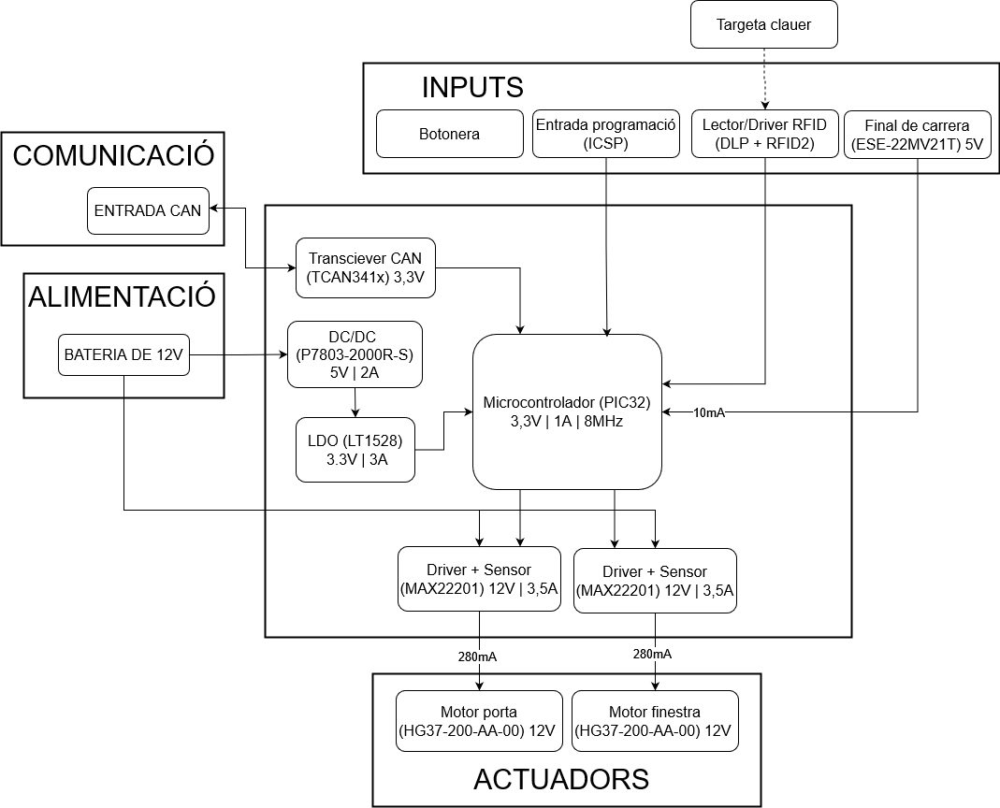

View this project on [CADLAB.io](https://cadlab.io/project/27987). 

# Projecte Eines de Disseny - PORTES
#### Adrià Brú, Miquel Limón, Lluís Pujadas

## Especificacions/Components

| Type                          | Name                  | Datasheet                                                                                                                                                                                                                                                                                                                                                                                                                                          | Link                                                                                                                                                     | Price      |
| ----------------------------- | --------------------- | -------------------------------------------------------------------------------------------------------------------------------------------------------------------------------------------------------------------------------------------------------------------------------------------------------------------------------------------------------------------------------------------------------------------------------------------------- | -------------------------------------------------------------------------------------------------------------------------------------------------------- | ---------- |
| uC                            | PIC32MK0256MCJ048     | [uC](https://ww1.microchip.com/downloads/aemDocuments/documents/MCU32/ProductDocuments/DataSheets/PIC32MK-General-Purpose-and-Motor-Control-With-CAN-FD-Family-DataSheet-DS60001570D.pdf)                                                                                                                                                                                                                                                          | [Mouser](https://www.mouser.es/ProductDetail/Microchip-Technology/PIC32MK0256MCJ048-E-Y8X?qs=vmHwEFxEFR%2FV8wN%2Fdp0noA%3D%3D)                           | 7,37 €     |
| LDO 3.3V (3A)                 | LT1528CT#PBF          | [LDO](https://rocelec.widen.net/view/pdf/nbjrjihvdn/LITCS09222-1.pdf?t.download=true&u=5oefqw)                                                                                                                                                                                                                                                                                                                                                     | [Digikey](https://www.digikey.es/en/products/detail/rochester-electronics-llc/LT1528CT-PBF/13481919)                                                     | 5,75 €     |
| Motor (588Nm, 280mA)          | HG37-200-AA-00        | [motor](https://www.mouser.es/datasheet/2/972/hg37-2525173.pdf)                                                                                                                                                                                                                                                                                                                                                                                    | [Mouser](https://www.mouser.es/ProductDetail/Nidec-Components/HG37-200-AA-00?qs=Wj%2FVkw3K%252BMBRymxOaiVRvg%3D%3D)                                      | 26,74 €    |
| CAN Transciever               | TCAN3413DR            | [can](https://www.ti.com/lit/ds/symlink/tcan3414.pdf?ts=1711721678762&ref_url=https%253A%252F%252Fwww.mouser.it%252F)                                                                                                                                                                                                                                                                                                                              | [Mouser](https://www.mouser.es/ProductDetail/Texas-Instruments/TCAN3413DR?qs=sGAEpiMZZMuyKkoWRCJ2WCtyf8MLmt92v%252BoGH2%2F%2FnqAqFeWM6BEVrA%3D%3D)       | 2,41 €     |
| Crystal Osc                   | ECS-3225SMV-080-GP-TR | [clk](https://www.mouser.es/datasheet/2/122/ECS_3225SMV-1623609.pdf)                                                                                                                                                                                                                                                                                                                                                                               | [Mouser](https://www.mouser.es/ProductDetail/ECS/ECS-3225SMV-080-GP-TR?qs=sGAEpiMZZMtldj7qu1ydrbV2KlGvrVWIvUi3jDw2tLHT0SWfK9heCg%3D%3D)                  | 1,92 €     |
| Driver (3.5A, +csense)        | MAX22201ATC+          | [driver](https://www.mouser.es/datasheet/2/609/MAX22201_MAX22207-3127854.pdf)                                                                                                                                                                                                                                                                                                                                                                      | [Mouser](https://www.mouser.es/ProductDetail/Analog-Devices-Maxim-Integrated/MAX22201ATC%2b?qs=stqOd1AaK7%252Bdqi04%2FQHs9Q%3D%3D)                       | 1,56 €     |
| ~~Current sensor (75A)~~      | ~~TMCS1123B2AQDVGR~~  | ~~[csense](https://www.ti.com/lit/ds/symlink/tmcs1123.pdf?ts=1711707167099&ref_url=https%253A%252F%252Fwww.ti.com%252Fproduct%252FTMCS1123%253Futm_source%253Dgoogle%2526utm_medium%253Dcpc%2526utm_campaign%253Dasc-null-null-GPN_EN-cpc-pf-google-wwe_cons%2526utm_content%253DTMCS1123%2526ds_k%253DTMCS1123%2526DCM%253Dyes%2526gad_source%253D1%2526gclid%253DEAIaIQobChMIrdeOip6ZhQMVVSitBh03AwOFEAAYAiAAEgLiCfD_BwE%2526gclsrc%253Daw.ds)~~ | ~~[Mouser](https://www.mouser.es/ProductDetail/Texas-Instruments/TMCS1123B2AQDVGR?qs=sGAEpiMZZMsPDRSCoHb1X5I%2FjBVAAn8DJGrzHYBTAmBFitJQJPL%2Fbw%3D%3D)~~ | ~~5,63 €~~ |
| Zener 12V (150MW)             | DDZ9699T-7            | [zener](https://eu.mouser.com/datasheet/2/115/DIOD_S_A0003550665_1-2542209.pdf)                                                                                                                                                                                                                                                                                                                                                                    | [Mouser](https://eu.mouser.com/ProductDetail/Diodes-Incorporated/DDZ9699T-7?qs=mQbszxtPdlOBwg08InvD3Q%3D%3D)                                             | 0,41 €     |
| Díode                         | BYV10MX-600PQ         | [diode](https://eu.mouser.com/datasheet/2/848/BYV10MX_600P-2401273.pdf)                                                                                                                                                                                                                                                                                                                                                                            | [Mouser](https://eu.mouser.com/ProductDetail/WeEn-Semiconductors/BYV10MX-600PQ?qs=QNEnbhJQKvYwaGjd%2F4%252BPWg%3D%3D)                                    | 0,54 €     |
| RFID                          | DLP-RFID2             | [rfid](https://mm.digikey.com/Volume0/opasdata/d220001/medias/docus/5656/DLP-RFID2%28D%29-V2.pdf)                                                                                                                                                                                                                                                                                                                                                  | [Digikey](https://www.digikey.es/en/products/detail/dlp-design-inc/DLP-RFID2/3770244)                                                                    | 35,04 €    |
| Motor lineal (150N, 2A) (opc) | DLA-12-5-A-50-IP65    | [motor-lineal](https://www.transmotec.com/Download/Catalog/Transmotec-EN-DLA-2022.pdf)                                                                                                                                                                                                                                                                                                                                                             | [Transmotec](https://www.transmotec.com/product/dla-12-5-a-50-pot-ip65/)                                                                                 | 303,5 €    |
| DC/DC 5V (2A, +/-49.5mV)      | P7805-2000R-S         | [dcdc2A](https://eu.mouser.com/datasheet/2/670/p78_2000r_s-3070500.pdf)                                                                                                                                                                                                                                                                                                                                                                            | [Mouser](https://eu.mouser.com/ProductDetail/CUI-Inc/P7803-2000R-S?qs=vvQtp7zwQdObalelOc2Obw%3D%3D)                                                      | 5,53 €     |
| DC/DC 3.3V (3A, +/-33.3mV)    | P783-Q24-S3-S         | [dcdc3A](https://eu.mouser.com/datasheet/2/670/p783_s-1889817.pdf)                                                                                                                                                                                                                                                                                                                                                                                 | [Mouser](https://eu.mouser.com/ProductDetail/CUI-Inc/P783-Q24-S3-S?qs=sPbYRqrBIVl7G8uy4wpmww%3D%3D)                                                      | 15,07 €    |
| C Tan 1u 20V 3216-18          | T491A105K020AT4360    | [ctant1u](https://eu.mouser.com/datasheet/2/447/KEM_T2005_T491-3316937.pdf)                                                                                                                                                                                                                                                                                                                                                                        | [Mouser](https://eu.mouser.com/ProductDetail/KEMET/T491A105K020AT4360?qs=sGAEpiMZZMsh%252B1woXyUXjyEnHz%2F1kG1y%2Fw9r1ZBsrUs%3D)                         | 0,07 €     |
| C Cer 22u 10V 1206            | CL31B226KPHNNWE       | [cer22u](https://eu.mouser.com/datasheet/2/585/MLCC-1837944.pdf)                                                                                                                                                                                                                                                                                                                                                                                   | [Mouser](https://eu.mouser.com/ProductDetail/Samsung-Electro-Mechanics/CL31B226KPHNNWE?qs=xZ%2FP%252Ba9zWqYr7HUxVtf3Yw%3D%3D)                            | 0,086 €    |
| C Cer 22u 50V                 | KTS500B226M76N0T00    | [ccer22u50v](https://eu.mouser.com/datasheet/2/420/nipc_s_a0010886389_1-2285932.pdf)                                                                                                                                                                                                                                                                                                                                                               | [Mouser](https://eu.mouser.com/ProductDetail/Chemi-Con/KTS500B226M76N0T00?qs=yFwz03cOJpkGGSneI4ka0Q%3D%3D)                                               | 3,58 €     |
| C Cer 10n 25V 1206            | KAM31BR81H103KT       | [ccer10n50v](https://eu.mouser.com/datasheet/2/40/AutoMLCCKAM-3216307.pdf)                                                                                                                                                                                                                                                                                                                                                                         | [Mouser](https://eu.mouser.com/ProductDetail/KYOCERA-AVX/KAM31BR81H103KT?qs=Jm2GQyTW%2FbjzijSUJGW%2FJA%3D%3D)                                            | 0,28 €     |
| C Ele 4.7u 35V                | 865080540002          | [cele4.7u](https://www.we-online.com/components/products/datasheet/865080540002.pdf)                                                                                                                                                                                                                                                                                                                                                               | [Mouser](https://eu.mouser.com/ProductDetail/Wurth-Elektronik/865080540002?qs=sGAEpiMZZMsh%252B1woXyUXj4jKQI6sNRw6puNwow3HMPo%3D)                        | 0,17 €     |
| C Ele 47u 16V                 | 860010372004          | [cele74u](https://www.we-online.com/components/products/datasheet/860010372004.pdf)                                                                                                                                                                                                                                                                                                                                                                | [Mouser](https://www.mouser.es/ProductDetail/Wurth-Elektronik/860010372004?qs=sGAEpiMZZMsh%252B1woXyUXj4jKQI6sNRw6V%2FBdkDX4IUo%3D)                      |            |
| C Cer 1u 25V 0805             | C0805C105K3RAC        | [cer1u25v](https://www.mouser.es/datasheet/2/447/KEM_C1002_X7R_SMD-3316098.pdf)                                                                                                                                                                                                                                                                                                                                                                    | [Mouser](https://www.mouser.es/ProductDetail/KEMET/C0805C105K3RAC?qs=ycRbFa0SLRQpHhAu2LUs4g%3D%3D)                                                       | 0,021 €    |
| C Cer 0.1u 50V 0805           | C0805C104M5RAC        | [cer100n0805](https://eu.mouser.com/datasheet/2/447/KEM_C1002_X7R_SMD-3316098.pdf)                                                                                                                                                                                                                                                                                                                                                                 | [Mouser](https://eu.mouser.com/ProductDetail/KEMET/C0805C104M5RAC?qs=VOOUd%252Bza08rWzt4y8eXMuQ%3D%3D)                                                   | 0,008 €    |
| C Cer 21p 50V 01005           | GRM0225C1H210GA02L    | [cer21p01005](https://eu.mouser.com/datasheet/2/281/murata_03052018_GRM_Series_1-1310166.pdf)                                                                                                                                                                                                                                                                                                                                                      | [Mouser](https://eu.mouser.com/ProductDetail/Murata-Electronics/GRM0225C1H210GA02L?qs=qkDYIeTQ%252BEl6hnZ3ixEkiA%3D%3D)                                  | 0,09 €     |
| R 120 125mW 0805              | CQ05WAF1200T5E        | [r120](https://www.mouser.es/datasheet/2/1365/10-3358738.pdf)                                                                                                                                                                                                                                                                                                                                                                                      | [Mouser](https://www.mouser.es/ProductDetail/Royalohm/CQ05WAF1200T5E?qs=sGAEpiMZZMtlubZbdhIBINZaoL9yqB51WBf9LviuJYE%3D)                                  | 0,002 €    |
| R 1k 125mW 0805               | TC05W8F1001T5G        | [r1k](https://eu.mouser.com/datasheet/2/1365/21-3077223.pdf)                                                                                                                                                                                                                                                                                                                                                                                       | [Mouser](https://eu.mouser.com/ProductDetail/Royalohm/TC05W8F1001T5G?qs=ST9lo4GX8V0X3zBMraFh1A%3D%3D)                                                    | 0,007 €    |
| R 330 125mW 0805              | TC0550F3300T5F        | [r330](https://eu.mouser.com/datasheet/2/1365/21-3077223.pdf)                                                                                                                                                                                                                                                                                                                                                                                      | [Mouser](https://eu.mouser.com/ProductDetail/Royalohm/TC0550F3300T5F?qs=T%252BzbugeAwjgeSBQZlDaTmA%3D%3D)                                                | 0,007 €    |
| R 10k 0.25W 0805              | RNCP0805JTD10K0       | [r10k](https://eu.mouser.com/datasheet/2/385/SEI_rncp-3077653.pdf)                                                                                                                                                                                                                                                                                                                                                                                 | [Mouser](https://eu.mouser.com/ProductDetail/SEI-Stackpole/RNCP0805JTD10K0?qs=IPgv5n7u5QaJFxYpOecM6A%3D%3D)                                              | 0,007 €    |
| R 100k 125mW 0805             | TC0550F1003T5G        | [r100k](https://eu.mouser.com/datasheet/2/1365/Royalohm_09132021_9__Thin_Film_20200106-2580434.pdf)                                                                                                                                                                                                                                                                                                                                                | [Mouser](https://eu.mouser.com/ProductDetail/Royalohm/TC0550F1003T5G?qs=Wj%2FVkw3K%252BMBYxpaKle1zIA%3D%3D)                                              | 0,007 €    |
| R 33k 125mW 0805              | TC0550D3302T5G        | [r33k](https://eu.mouser.com/datasheet/2/1365/Royalohm_09132021_9__Thin_Film_20200106-2580434.pdf)                                                                                                                                                                                                                                                                                                                                                 | [Mouser](https://eu.mouser.com/ProductDetail/Royalohm/TC0550D3302T5G?qs=Wj%2FVkw3K%252BMB5M6MpcX7%252Byw%3D%3D)                                          | 0,008 €    |

## Diagrama de blocs

## To Do
- [x] Add buttons
- [x] Add power input protection
- [x] Add controls
- [ ] Resize boxes to same size (diagram)
- [ ] Change "targeta" to "targeta clauer"
- [x] Restructure schematic for simplicity
- [x] Add buttons to schematic
- [x] Add expression for R (ISENSE)
- [x] Change regulator to DC/DC (maybe + regulator)
- [ ] PCB v1
- [ ] Change 2nd crystal to 32kHz (instead of 8MHz)

## Changelogs
### 03/04
- Schematic done
- Corrected block diagram
	- Added additional data
	- Deleted 12V LDO
	- Changed current sensor for integrated Driver+Sensor
### 04/04
- Swapped regulator for DC/DC
- Add expression for R (ISENSE)
- Change regulator to DC/DC (maybe + regulator)
- Restructure schematic for simplicity
- Added 1 extra bit for window control

### 05/04 
- Added all components
- PWR plane done (v1)

### 06/04
- Corrected PWR
- Started digital

### 08/04
- Corrected diagram
- Changed from DC/DC to DC/DC (5V) + LDO (3,3V)
- Change second Clk to 32kHz